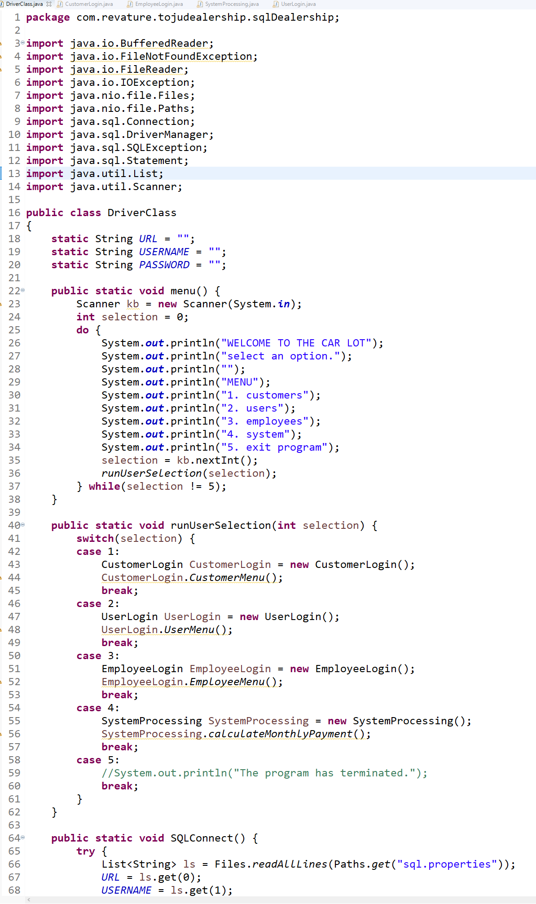

[click here to go back](./)

#### Revature Project 1

Set up a car Dealership program in Java that allowed the user to purchase a car, and then when the car was purchased, the car would be removed from the car dealership database and placed in the customer’s database. Used Java, DBeaver, PostgreSQL, and Amazon AWS to host the database to the cloud.

Console output of the program running in Spring Tool Suite

Some code using JDBC

