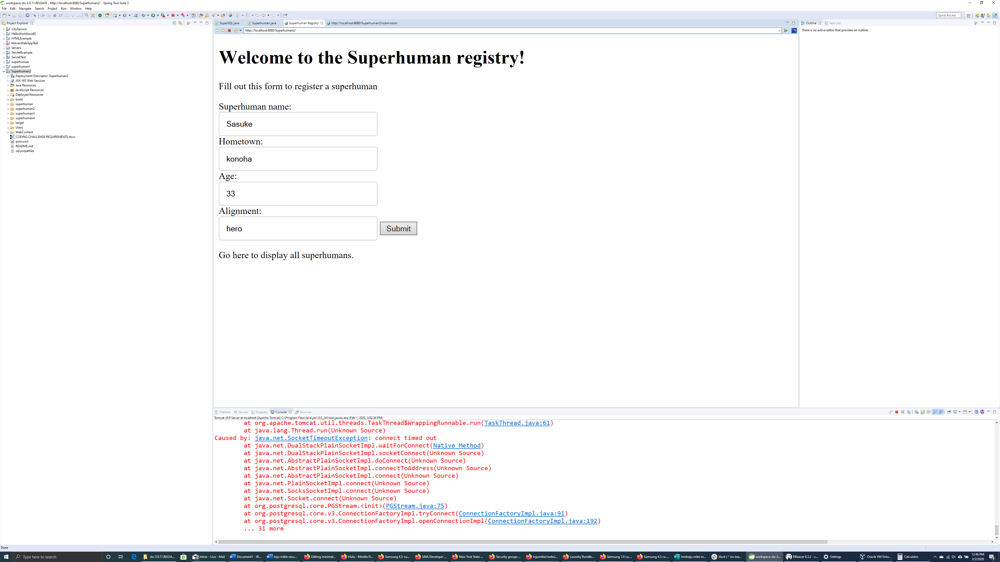
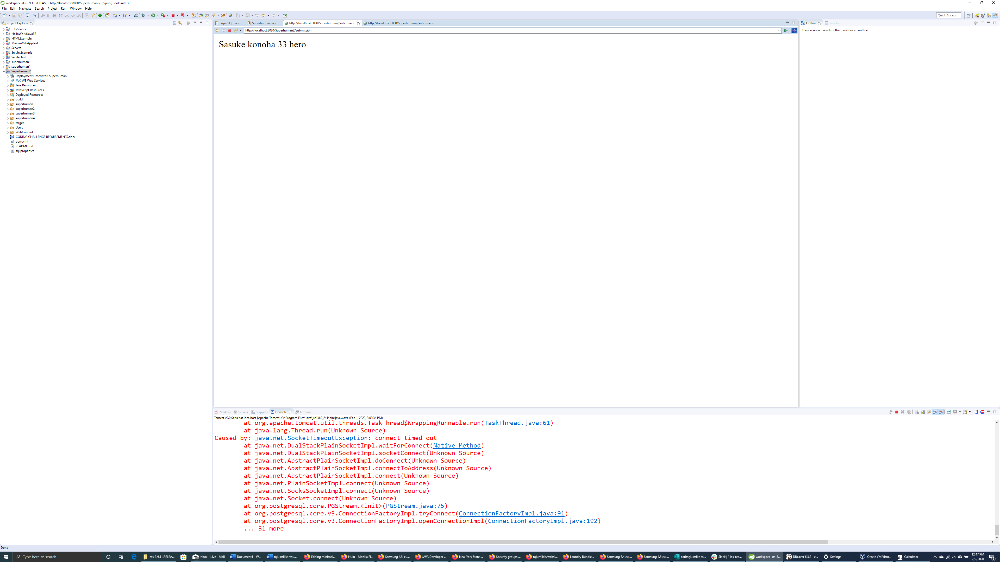
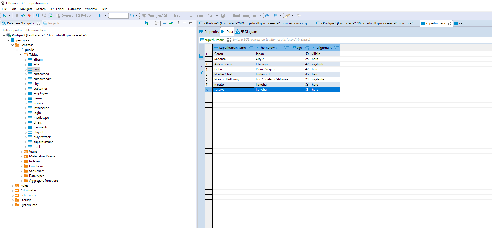
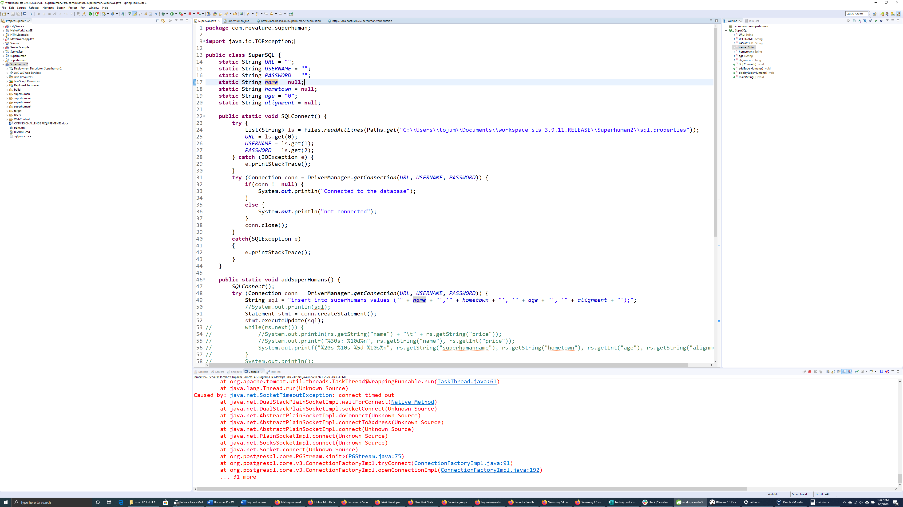
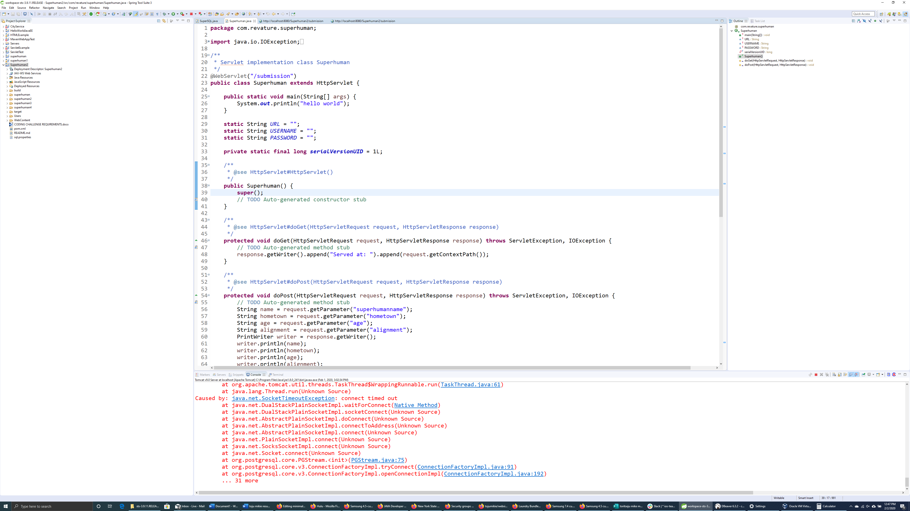

[click here to go back](./)

[click here to go to the project page](https://github.com/tojumikie/superhuman).

#### Revature Project 2

Set up a Superhuman Registry program to register Superhumans and put them into the database. Used servlets and Apache Tomcat 9 to run the web-based application, HTML and CSS to display the webpage, DBeaver and PostgreSQL to verify the database entries, and Amazon AWS to host the database to the cloud.

